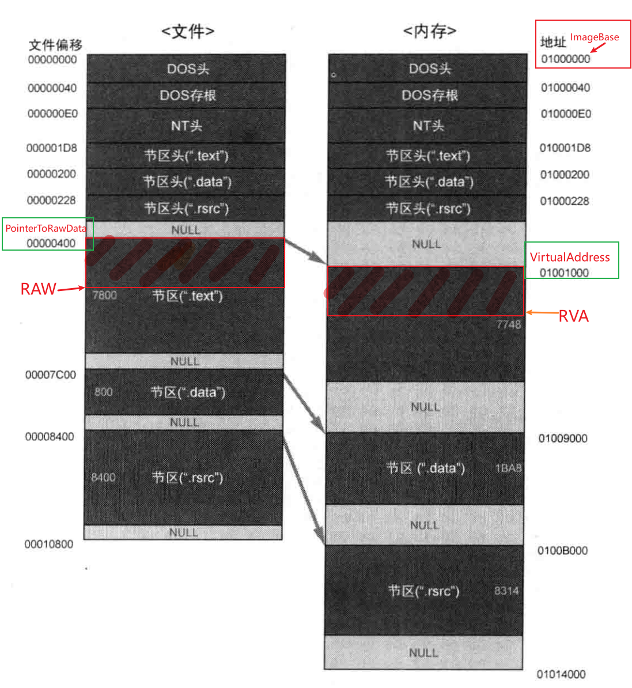
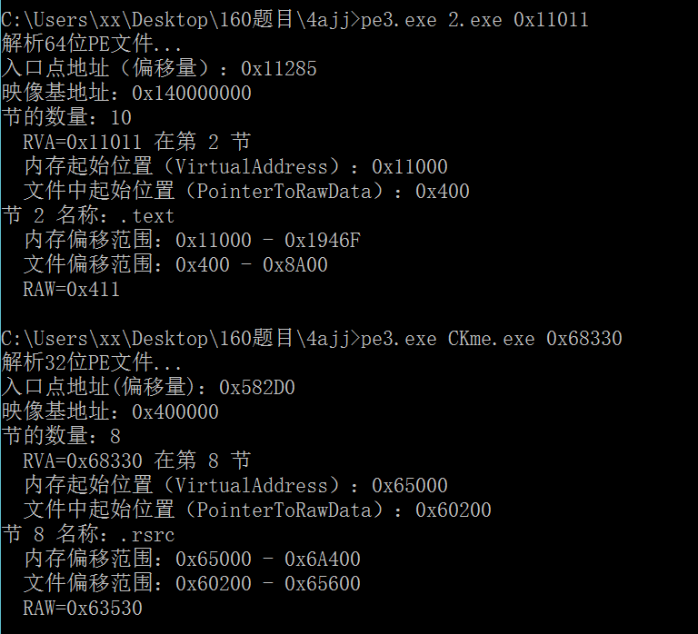

## 需求简介：PE文件RVAtoRAW,为什么需要这样做？

RVA 和 RAW 偏移的转换需求源自于 PE 文件在磁盘和内存中布局的差异。**为了正确解析、提取、或操作 PE 文件中的数据**，尤其是在逆向工程和静态分析时，RVAtoRAW 的转换是必不可少的步骤。

## 转换核心算法：RAW=RVA-VirtualAddress+PointerToRawData

RAW-PointerToRawData=RVA-VirtualAddress=（数据内容宽度不变）

磁盘文件中数据的偏移量-磁盘文件中数据所在节区的起始位置=内存中数据相对于基址（ImageBase）的偏移量-内存中数据所在节区的起始位置

原理：

##  问：正常未被压缩的PE文件中，已知一个RVA=Y值，求File Offset=？
要求输出RVA在哪个节？
打印出内存中该节的内存起始位置(偏移)VirtualAddress?
打印出文件中对应节的PointerRawData的位置？

结果：

## ps：
1、为了确保PE文件的正确加载和执行，需要仔细检查这些对齐要求，确保所有节都符合文件和内存对齐规则。
* PointerToRawData 是节在文件中存储的位置，它必须满足 FileAlignment 的要求。FileAlignment 常见值是 0x200（512字节），表示文件中节的起始偏移量需要是512字节的倍数。如果 PointerToRawData 不是512的倍数，文件对齐就会失败。

* SizeOfRawData 是节在文件中占用的字节数，通常需要是 FileAlignment 的倍数。如果大小不满足 FileAlignment 的倍数要求，就会有问题。

* VirtualAddress 是节在内存中加载的位置，它必须满足 SectionAlignment 的要求。SectionAlignment 常见值是 0x1000（4KB），表示节在内存中需要以4 KB为边界对齐。如果 VirtualAddress 不是4 KB的倍数，就会导致内存对齐不满足。

**对齐不满足的常见情况包括：

PointerToRawData 不是 FileAlignment 的倍数。

SizeOfRawData 不是 FileAlignment 的倍数。

VirtualAddress 不是 SectionAlignment 的倍数。

VirtualSize 和 SizeOfRawData 不合理差异。【内存中大于文件中大小--填充较多造成浪费】【 内存中大小可以小于文件中大小--内存中用到的数据不多】

SectionAlignment 和 FileAlignment 的不一致设计问题。**

2、File Offset 是指一个节（或数据块）在磁盘文件中的位置（即偏移量），用字节表示。它定义了从文件的开头到指定节或数据块起始位置之间的距离，通常用于定位文件中的特定数据。

